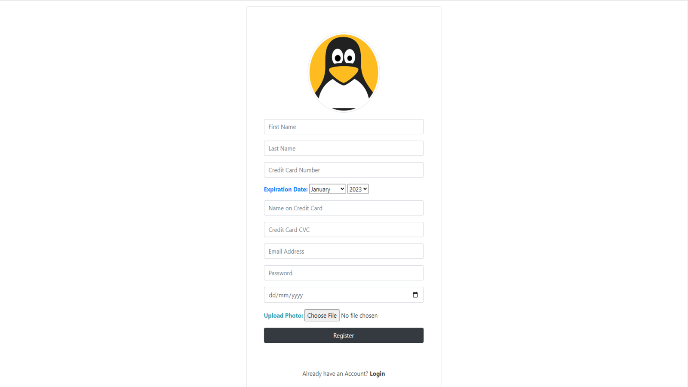
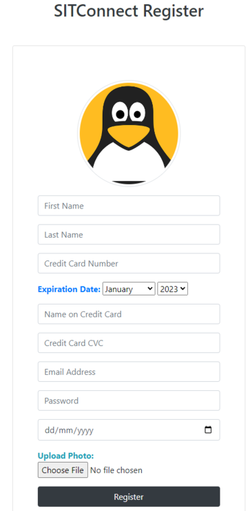

	<h1>SITConnect
	 
		
		
		
		
		 
	</h1>

## Description

 Triggers that automatically identify threats and implements mitigation methods for common vulnerabilities, specifically those in the OWASP Top 10 & MITRE. Technologies employed include reCAPTCHA, Regex, SQL and Cryptography

## Built Using

- ASP .NET 
- reCAPTCHA 
- CSharp 
- MySQL 

## Preview

#### Desktop

#### Mobile

